# Rentfix Database Schema

## Overview

This document describes the PostgreSQL database schema for Rentfix, a multi-tenant property management platform with contractor marketplace functionality.

### Key Design Principles

1. **Multi-Tenancy**: Row-Level Security (RLS) ensures complete data isolation between organizations
2. **Soft Deletes**: All tables support soft deletion via `deleted_at` column (GDPR compliant)
3. **Event Sourcing**: Immutable `event_log` table provides audit trail and replay capability
4. **Contractor Marketplace**: Fully searchable with public profiles, ratings, portfolio, and qualifications

---

## Entity Relationship Diagram

```mermaid
erDiagram
    %% Core Identity & Multi-tenancy
    users ||--o{ refresh_tokens : "has"
    users ||--o{ roles : "assigned"
    users ||--o| contractors : "profile"
    users ||--o{ audit_logs : "generates"
    users ||--o{ notification_logs : "receives"

    organizations ||--o{ roles : "defines"
    organizations ||--o{ properties : "owns"
    organizations ||--o{ tenant_invites : "sends"
    organizations ||--o| users : "owned_by"

    %% Property Management
    properties ||--o{ units : "contains"
    units ||--o{ tickets : "has"

    %% Tickets & Assignments
    tickets ||--o{ ticket_state_history : "tracks"
    tickets ||--o{ evidence : "has"
    tickets ||--o| assignments : "assigned"
    tickets }o--o| contractors : "assigned_to"

    assignments }o--|| contractors : "performed_by"
    assignments ||--o{ payments : "generates"

    %% Contractor Marketplace
    contractors ||--o{ contractor_availability : "schedules"
    contractors ||--o{ contractor_ratings : "receives"
    contractors ||--o{ contractor_portfolio : "showcases"
    contractors ||--o{ contractor_qualifications : "holds"

    %% Event Sourcing
    event_log }o--o| users : "actor"
    event_log }o--o| organizations : "scoped_to"

    %% Entity Definitions
    users {
        uuid id PK
        uuid tenant_id FK
        varchar email UK
        varchar email_normalized UK
        varchar password_hash
        enum role
        varchar phone_e164
        varchar first_name
        varchar last_name
        boolean email_verified
        boolean phone_verified
        timestamptz deleted_at
        integer version
    }

    organizations {
        uuid id PK
        uuid owner_user_id FK
        varchar name
        varchar stripe_customer_id
        varchar plan
        varchar status
        integer properties_quota
        timestamptz deleted_at
    }

    roles {
        uuid id PK
        uuid user_id FK
        uuid organization_id FK
        jsonb permission_grants
        timestamptz deleted_at
    }

    properties {
        uuid id PK
        uuid tenant_id
        uuid organization_id FK
        text address
        uuid landlord_id
        uuid agent_id FK
        timestamptz deleted_at
        integer version
    }

    units {
        uuid id PK
        uuid property_id FK
        text unit_number
        text occupancy_status
        timestamptz deleted_at
        integer version
    }

    tickets {
        uuid id PK
        uuid unit_id FK
        uuid tenant_id
        text issue_type
        text description
        enum status
        uuid assigned_contractor_id FK
        timestamptz deleted_at
        integer version
    }

    contractors {
        uuid id PK
        uuid user_id FK,UK
        uuid organization_id
        varchar business_name
        jsonb specialties
        decimal hourly_rate
        varchar insurance_cert_url
        date insurance_expiry
        enum status
        enum background_check_status
        jsonb service_area
        decimal average_rating
        integer total_jobs_completed
        timestamptz deleted_at
    }

    contractor_availability {
        uuid id PK
        uuid contractor_id FK
        date date
        time start_time
        time end_time
        enum status
        enum recurrence_pattern
        date recurrence_end_date
        integer max_jobs
        integer booked_jobs
        timestamptz deleted_at
    }

    contractor_ratings {
        uuid id PK
        uuid contractor_id FK
        uuid ticket_id
        uuid organization_id
        uuid rated_by_user_id FK
        enum source
        decimal overall_score
        decimal quality_score
        decimal punctuality_score
        decimal communication_score
        decimal value_score
        decimal professionalism_score
        text review
        boolean is_public
        boolean is_verified
        text contractor_response
        timestamptz deleted_at
    }

    contractor_portfolio {
        uuid id PK
        uuid contractor_id FK
        uuid ticket_id
        varchar title
        text description
        enum media_type
        varchar media_url
        varchar thumbnail_url
        varchar specialty
        jsonb tags
        varchar before_photo_url
        varchar after_photo_url
        date job_date
        enum status
        boolean is_featured
        integer display_order
        timestamptz deleted_at
    }

    contractor_qualifications {
        uuid id PK
        uuid contractor_id FK
        enum type
        varchar name
        text description
        varchar issuing_body
        varchar credential_id
        date issued_at
        date expires_at
        varchar document_url
        enum verification_status
        boolean is_public
        jsonb specialties
        timestamptz deleted_at
    }

    assignments {
        uuid id PK
        uuid ticket_id FK,UK
        uuid contractor_id FK
        timestamptz scheduled_at
        timestamptz accepted_at
        timestamptz completed_at
        enum final_status
        timestamptz deleted_at
    }

    event_log {
        uuid id PK
        bigint sequence_number
        varchar event_type
        integer event_version
        varchar aggregate_type
        uuid aggregate_id
        uuid organization_id
        uuid actor_id
        varchar actor_type
        jsonb payload
        jsonb previous_state
        uuid correlation_id
        uuid causation_id
        inet ip_address
        text user_agent
        timestamptz created_at
    }
```



---

## Table Descriptions

### Core Identity Tables

| Table | Description | RLS Policy |
|-------|-------------|------------|
| `users` | User accounts with roles (tenant/agent/contractor/admin) | Tenant isolation + self access |
| `organizations` | Multi-tenant organizations (property management companies) | Owner + member access |
| `roles` | RBAC role assignments with permission grants | Organization scoped |
| `refresh_tokens` | JWT refresh tokens with device fingerprinting | User self-access only |
| `audit_logs` | Comprehensive security audit trail | Admin + organization + self |
| `tenant_invites` | Pending tenant invitations | Organization scoped |

### Property Management Tables

| Table | Description | RLS Policy |
|-------|-------------|------------|
| `properties` | Properties managed by organizations | Organization scoped |
| `units` | Individual units within properties | Inherited from property |
| `tickets` | Maintenance/repair tickets | Tenant + assigned contractor |
| `ticket_state_history` | Audit trail for ticket state changes | Inherited from ticket |
| `evidence` | Photos/videos attached to tickets | Inherited from ticket |
| `assignments` | Contractor job assignments | Organization + contractor |
| `payments` | Payment records for completed work | Organization + contractor |

### Contractor Marketplace Tables

| Table | Description | RLS Policy |
|-------|-------------|------------|
| `contractors` | Contractor profiles (searchable) | Public (verified) + self |
| `contractor_availability` | Calendar slots for scheduling | Public (verified) + self |
| `contractor_ratings` | Individual ratings with reviews | Public ratings + self |
| `contractor_portfolio` | Work samples and photos | Public (approved) + self |
| `contractor_qualifications` | Certifications and badges | Public (verified) + self |

### Event Sourcing Tables

| Table | Description | RLS Policy |
|-------|-------------|------------|
| `event_log` | Immutable event log (append-only) | Admin + organization + actor |

---

## Row-Level Security (RLS) Overview

```
┌─────────────────────────────────────────────────────────────────────┐
│                        RLS Session Variables                         │
├─────────────────────────────────────────────────────────────────────┤
│  app.current_tenant_id   │ UUID of current organization             │
│  app.current_user_id     │ UUID of current user                     │
│  app.is_admin            │ Boolean flag for admin bypass            │
│  app.is_contractor       │ Boolean flag for contractor role         │
└─────────────────────────────────────────────────────────────────────┘

┌─────────────────────────────────────────────────────────────────────┐
│                         RLS Policy Tiers                             │
├─────────────────────────────────────────────────────────────────────┤
│  Tier 1: Admin Bypass                                                │
│  └── Admins can access all data across tenants                      │
│                                                                      │
│  Tier 2: Organization Isolation                                      │
│  └── Users can only access data within their organization           │
│                                                                      │
│  Tier 3: Self Access                                                 │
│  └── Users can access their own records (notifications, tokens)     │
│                                                                      │
│  Tier 4: Public Access (Marketplace)                                 │
│  └── Verified contractors & approved content visible to all         │
└─────────────────────────────────────────────────────────────────────┘
```

---

## Marketplace Search Indexes

```sql
-- Full-text search on contractor profiles
idx_contractors_search (GIN) - business_name + specialties

-- Specialty + rating search
idx_contractors_marketplace_search (GIN) - specialties
idx_contractors_rating_location - average_rating DESC, status

-- Portfolio search
idx_portfolio_marketplace - specialty, display_order
idx_contractor_portfolio_tags (GIN) - tags

-- Availability search
idx_contractor_availability_date_status - date, status
```

---

## GDPR Compliance

### Soft Delete Strategy
- All tables have `deleted_at` column
- Queries automatically exclude soft-deleted records
- Records retained for audit purposes

### Data Retention
- Soft-deleted records anonymized after 90 days (configurable)
- `gdpr_soft_delete_user()` function for right-to-erasure requests
- `anonymize_deleted_records()` for periodic cleanup

### Event Immutability
- `event_log` table is append-only
- Triggers prevent UPDATE/DELETE operations
- Provides complete audit trail for compliance

---

## Schema Version

| Migration | Description | Date |
|-----------|-------------|------|
| 0001 | Initial schema | - |
| 0002 | Auth enhancements | - |
| 0003 | Contractor entity | - |
| 0004 | RLS + Contractor Marketplace | 2025-12-11 |
